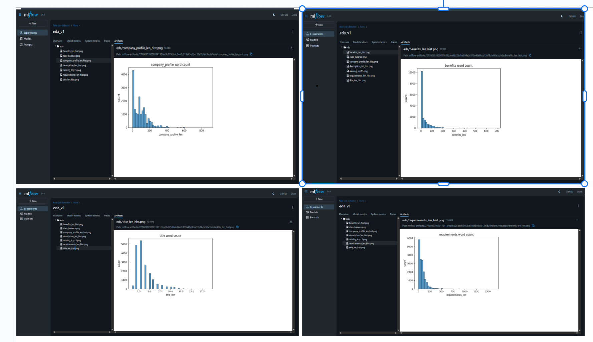
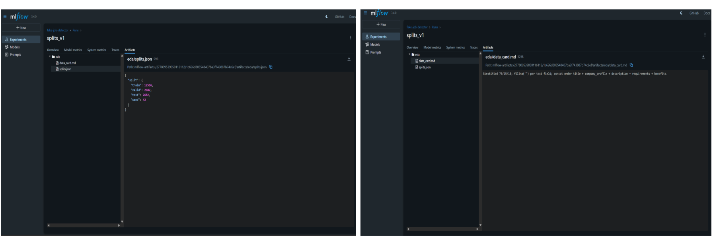
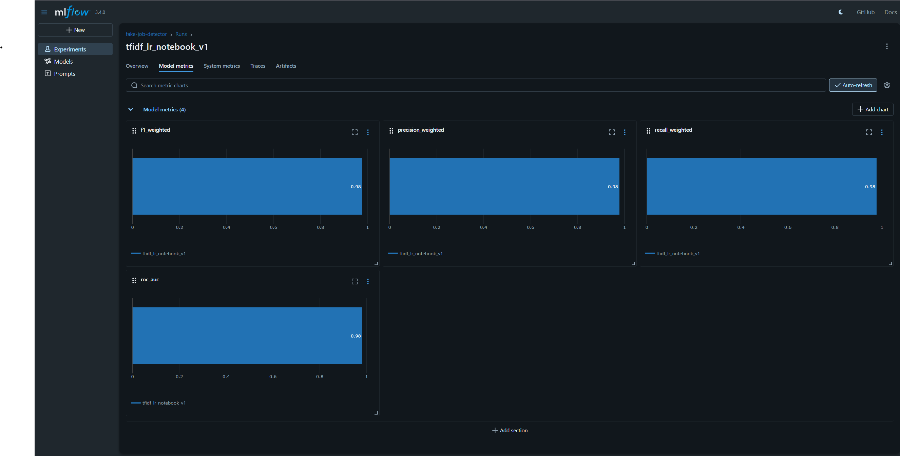

# Fake Job Detector — Week 1

Baseline TF‑IDF + Logistic Regression for fake job posting detection. Week 1 delivers:
- Data audit + EDA figures
- Stratified 70/15/15 splits saved to data/processed
- Baseline model training with metrics, confusion matrix, and model artifact
- Full experiment tracking in MLflow

## Environment and MLflow

- Create/activate venv (Windows PowerShell):
  .\.venv\Scripts\Activate.ps1
  python -m pip install -r requirements.txt

- Start MLflow tracking server (new terminal):
  mlflow server --host 127.0.0.1 --port 5000 ^
    --backend-store-uri "sqlite:///C:/mlflow/mlruns.db" ^
    --default-artifact-root "file:///C:/mlflow/artifacts"

- Tracking URI and experiment used in notebooks/scripts:
  http://127.0.0.1:5000
  fake-job-detector

mlflow.set_tracking_uri("http://127.0.0.1:5000")
mlflow.set_experiment("fake-job-detector")

## Reproduce Week 1

- notebooks/01_eda_and_splits.ipynb
  - Logs EDA figures: eda/class_balance.png, eda/*_len_hist.png, eda/missing_top15.png
  - Saves processed splits to data/processed/{train,valid,test}.csv
  - Logs split metadata: eda/splits.json and eda/data_card.md (run name: splits_v1)

- notebooks/02_baseline_tfidf_lr.ipynb
  - Trains TF‑IDF + Logistic Regression baseline
  - Logs metrics: roc_auc, f1_weighted, precision_weighted, recall_weighted
  - Logs confusion matrix: eval/confusion_matrix_valid.png
  - Logs model: model/ (MLflow artifact), and saves assets/baseline_tfidf_lr.joblib locally

## Quick start

# 1) Start MLflow (separate terminal)
mlflow server --host 127.0.0.1 --port 5000 --backend-store-uri "sqlite:///C:/mlflow/mlruns.db" --default-artifact-root "file:///C:/mlflow/artifacts"

# 2) Jupyter kernel (first time only)
python -m ipykernel install --user --name fakejobs-venv --display-name "Python (fakejobs-venv)"

# 3) Open notebooks, select kernel "Python (fakejobs-venv)", run top to bottom

## MLflow screenshots

## MLflow screenshots

- EDA run (eda_v1) — artifacts list and example figure
- Splits run (splits_v1) — eda/splits.json and eda/data_card.md
- Baseline run (tfidf_lr_notebook_v1) — metrics and confusion matrix

## Reproducibility

- Seed = 42; stratified 70/15/15
- Text concatenation: title + company_profile + description + requirements + benefits (fillna(""))
- Suggested MLflow tags:
  mlflow.set_tags({"dataset":"kaggle_fraud_v1","seed":"42"})

## Next steps (Week 2)

- Add PR curve and threshold analysis
- Feature ablations (char n‑grams, max_features search)
- Register “best” model to Model Registry (optional)

